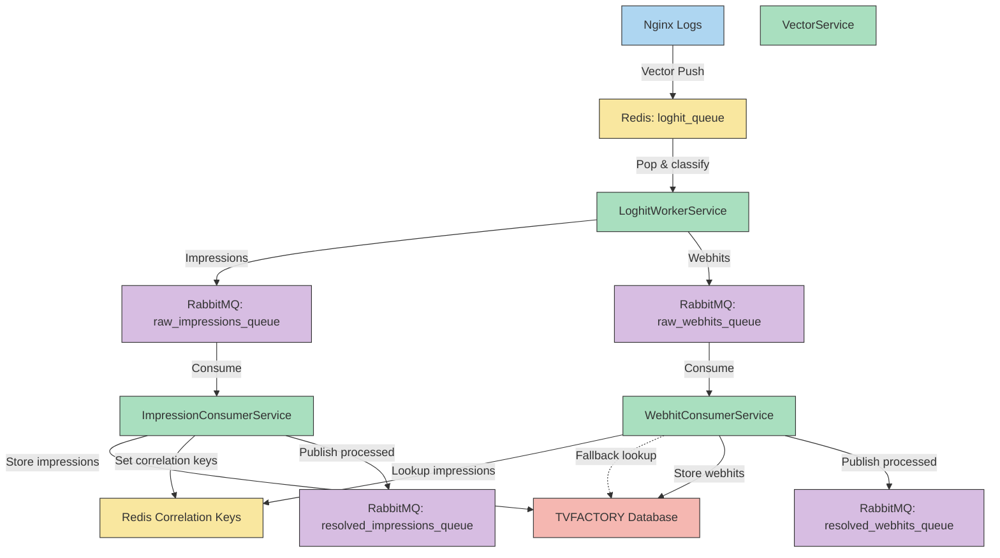

```markdown
# Infinitum Collector Service - README

## 📡 IP Addresses

| Name                      | IP Address       |
|---------------------------|------------------|
| collection-mediaserver    | 172.105.162.20   |
| processing-mediaserver    | 172.105.162.40   |
| datawarehouse-mediaserver | 172.105.162.93   |
| bvod-db                   | 194.195.126.89   |
| tvbvod1                   | 172.105.254.151  |
| tvbvod2                   | 172.105.255.194  |
| tvbvod3                   | 172.105.255.205  |
| tvbvod4                   | 172.105.255.36   |
| tvbvoddb1                 | 172.105.255.16   |
| tvbvoddb2                 | 45.79.239.60     |
| tvbvodsite1               | 194.195.121.207  |
| tvbvodsite2               | 172.105.175.91   |
| tvbvod5                   | 172.105.173.148  |
| tvbvod6                   | 172.105.173.170  |
| redis-edgeserver          | 172.105.189.75   |
| tvbvodsite3               | 192.46.221.193   |
| tvbvodsite4               | 172.105.187.245  |
| redis-processor           | 172.105.176.221  |


## Overview

The Collector Service sits at the beginning of the Infinitum data pipeline, elegantly intercepting advertising impression events and website visits. One might call it the reconnaissance phase of our operation, Steed. 

## Service Components

### LoghitWorkerService
Efficiently processes logs with minimal fuss:
- Consumes entries from Redis `loghit_queue`, fed by the vector service on the edge servers
- Classifies each entry as either "impression" or "webhit"
- Routes entries to appropriate RabbitMQ queues
- Handles batch processing for optimal throughput

### ImpressionConsumerService
Processes advertising impressions with sophisticated precision:
- Consumes messages from `raw_impressions_queue`
- Validates impression data (client, booking, creative)
- Normalizes IP addresses
- Inserts records into TVFACTORY database edge_data, primarily to get ids, adds the ids to the records 
- Creates correlation keys in Redis (`imp:{client}:{ip}`)
- Publishes processed impressions to `resolved_impressions_queue`

### WebhitConsumerService
Handles website visits with refined correlation capabilities:
A webhit is a webhit if all the following are true:
An impression for the same combination of ipaddress and client_id have been received in the last seven days
- Consumes messages from `raw_webhits_queue`
- Correlates visits with impressions using Redis or database lookups
- Prevents duplicate processing through Redis deduplication
- Inserts validated records into TVFACTORY database edge_data, primarily to get ids, adds the ids to the records
- Publishes processed webhits to `resolved_webhits_queue`

## Data Flow
```

```markdown
## Execution Modes

The service has multiple operating roles:
- `loghit`: Processes Redis queue entries into RabbitMQ
- `impression`: Processes impression events from RabbitMQ
- `webhit`: Processes website visit events from RabbitMQ
- `sequence`: Runs the complete chain (loghit → impression → webhit)

## Design Assessment

The collector service demonstrates an elegant approach to data acquisition and initial processing:

**Strengths:**
- Clean separation of concerns between components
- Intelligent use of Redis for state tracking and correlation
- Efficient batch processing with appropriate timeouts
- Sophisticated error handling and health checks
- Graceful handling of log rotation

**Points of Refinement:**
- Some direct coupling between components that could use further abstraction
- Potentially excessive Redis key usage for high-volume traffic

Overall, the design shows a thoughtful balance between performance and reliability, capturing the essence of an effective ETL pipeline's first stage.
```
